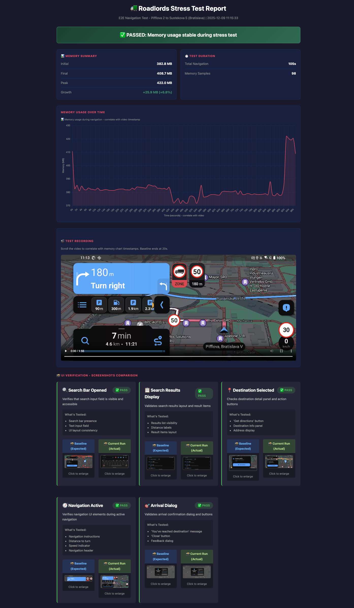

# Mobile App E2E Test Automation - Complete Guide
---

### Obsah balíka

```
roadlords-automation/
├── setup.command / setup.bat       # Auto-inštalácia všetkých nástrojov
├── Run Roadlords Test.command/bat  # Spustenie test runnera
├── uninstall.command / uninstall.bat # Odinštalovanie
├── app/
│   └── roadlords_tester_web.py     # Web GUI pre spúšťanie testov
├── tests/e2e/
│   └── test_navigation_route_following.py  # E2E test
├── src/
│   ├── gps/gps_mock_controller.py  # GPS simulácia
│   └── utils/
│       ├── memory_monitor.py       # Monitoring RAM
│       ├── video_recorder.py       # Nahrávanie obrazovky
│       ├── ui_verifier.py          # Screenshot porovnávanie
│       └── report_generator.py     # HTML reporty
├── android-gps-mock/
│   └── gps-mock.apk                # Custom GPS Mock Android app
└── reports/
    └── ui_baseline/baseline.json   # Baseline pre UI verifikáciu
```

---

## 🔧 Ako to funguje

### Architektúra

```
┌─────────────────┐     ┌─────────────────┐     ┌─────────────────┐
│   Test Runner   │────▶│     Appium      │────▶│  Android Phone  │
│   (Python)      │     │    Server       │     │   (Roadlords)   │
└─────────────────┘     └─────────────────┘     └─────────────────┘
        │                                                │
        │  ADB commands                                  │
        ▼                                                ▼
┌─────────────────┐                            ┌─────────────────┐
│   GPS Mock      │◀───────────────────────────│   GPS Mock App  │
│   Controller    │      ADB broadcasts        │   (on device)   │
└─────────────────┘                            └─────────────────┘
```

### Technológie

| Komponent | Technológia | Účel |
|-----------|-------------|------|
| Test Framework | Python + pytest | Písanie a spúšťanie testov |
| Mobile Automation | Appium + UiAutomator2 | Interakcia s Android UI |
| GPS Simulation | Custom Android app | Mock GPS lokácie |
| Reporting | HTML + Screenshots | Vizuálne reporty |
| UI Verification | SSIM (scikit-image) | Porovnávanie screenshots |

### Testovací flow

```
1. Force-stop aplikácií (Roadlords, io.appium.settings)
2. Nastavenie GPS Mock ako mock_location_app
3. Nastavenie štartovacej GPS pozície
4. Spustenie Roadlords cez Appium
5. Interakcia s UI (vyhľadávanie, navigácia)
6. Spustenie GPS playback z GPX súboru
7. Monitoring (pamäť, screenshots, video)
8. Detekcia príchodu na cieľ
9. UI verifikácia (porovnanie s baseline)
10. Generovanie HTML reportu
```

### Test Report

Report je interaktívny HTML súbor, ktorý kombinuje všetky dáta zozbierané počas testu - pamäťové metriky, video záznam a vizuálnu verifikáciu UI. Umožňuje rýchlo identifikovať problémy (memory leaky, UI regresie) bez potreby manuálne prechádzať logy.



Po dokončení testu sa automaticky generuje HTML report s týmito sekciami:

**Memory Summary**
- Initial / Final / Peak memory usage
- Memory growth počas testu (v MB a %)
- Celková dĺžka navigácie a počet vzoriek

**Memory Usage Over Time**
- Interaktívny graf spotreby pamäte
- Korelácia s video timestampom
- Detekcia memory leakov

**Test Recording**
- Video záznam celého testu
- Synchronizovaný s grafom pamäte
- Možnosť prehrať konkrétne momenty

**UI Verification - Screenshots Comparison**
- Porovnanie Baseline (Expected) vs Current Run (Actual)
- Automatická detekcia UI zmien pomocou SSIM algoritmu
- Verifikačné body:
  - Search Bar Opened - viditeľnosť search inputu
  - Search Results Display - layout výsledkov vyhľadávania
  - Destination Selected - panel s detailmi cieľa
  - Navigation Active - navigačné inštrukcie, rýchlosť, vzdialenosť
  - Arrival Dialog - potvrdenie príchodu na cieľ

Každý verifikačný bod zobrazuje:
- PASS / FAIL status
- Popis čo sa testuje
- Thumbnail baseline a aktuálneho screenshotu
- Možnosť zväčšiť pre detailné porovnanie

---

## 🔑 Výhody prístupu k zdrojovému kódu (pre vývojárov Roadlords)

Tento framework som vytvoril bez prístupu k zdrojovému kódu aplikácie - pracoval som s produkčnou verziou z Google Play ako "black-box". To prináša určité obmedzenia, ktoré vy ako vývojári s prístupom k zdrojákom nemáte.

### Čo som musel riešiť bez prístupu k zdrojákom

| Problém | Moje riešenie | S prístupom k zdrojákom |
|---------|---------------|-------------------------|
| GPS simulácia | Externá GPS Mock aplikácia + ADB broadcast | Priamo v kóde: `LocationManager.setTestProviderLocation()` |
| Hľadanie UI elementov | XPath, text, content-desc (nestabilné) | Pridať `resource-id` / `testTag` priamo v kóde |
| Overenie stavu aplikácie | Screenshot comparison (SSIM) | Priamy prístup k stavu cez test API |
| Čakanie na operácie | Fixné timeouty / polling | Synchronizácia s internými eventami |
| Trasy pre testovanie | Sťahovanie GPX z mapy.cz | Generovanie trás priamo v debug builde |

### Vaše výhody s debug buildom

**1. Accessibility IDs / Resource IDs**

Jetpack Compose štandardne negeneruje `resource-id` pre elementy. Vy môžete pridať:

```kotlin
// Kotlin/Compose
Modifier.testTag("search_button")

// alebo semantics
Modifier.semantics { contentDescription = "search_button" }
```

Toto vám umožní stabilné lokátory namiesto krehkých XPath výrazov, ktoré som musel používať ja.

**2. Test Mode / Debug API**

Môžete si vytvoriť špeciálny debug build s:
- **Bypass autentifikácie** - preskočenie login flow pre testy
- **Mock server responses** - testovanie edge cases bez reálneho servera
- **Interný GPS provider** - nastavenie lokácie priamo v aplikácii bez externej mock app
- **Test routes** - preddefinované trasy priamo v aplikácii
- **Skip animations** - rýchlejšie testy bez čakania na animácie
- **Exposed state** - prístup k internému stavu cez test API

```kotlin
// Príklad: Debug-only endpoint pre nastavenie lokácie
if (BuildConfig.DEBUG) {
    fun setTestLocation(lat: Double, lon: Double) {
        locationProvider.setMockLocation(lat, lon)
    }
}
```

**3. Gray-box testing s Detox/Espresso**

Namiesto Appium (black-box), ktoré som použil ja, môžete použiť:
- **Espresso** (Android) - priama integrácia s UI, automatická synchronizácia
- **Detox** (React Native) - gray-box prístup s kontrolou nad lifecycle aplikácie

Tieto frameworky bežia "vnútri" aplikácie a majú prístup k:
- UI thread synchronizácii (žiadne flaky testy kvôli timingom)
- Interným callbackom a eventom
- Databáze a shared preferences

**4. Priame overenie stavu**

Namiesto screenshot porovnávania (ktoré som musel použiť ja) môžete priamo overiť:

```kotlin
// Priamy test namiesto SSIM comparison
@Test
fun testNavigationStarted() {
    onView(withId(R.id.navigation_panel)).check(matches(isDisplayed()))
    assertEquals("Bratislava", viewModel.destination.value)
    assertTrue(navigationService.isActive)
}
```

**5. Kontinuálna integrácia**

S debug buildom môžete:
- Automaticky spúšťať testy pri každom builde
- Integrovať do CI/CD bez potreby fyzického zariadenia (Android emulátory)
- Paralelizovať testy na viacerých emulátoroch

### Moje odporúčania pre vás

1. **Pridať `testTag` ku kľúčovým UI elementom** - search bar, navigation panel, arrival dialog
2. **Vytvoriť debug build flavor** s test utilities
3. **Implementovať interný GPS mock** - jednoduchšie ako moja externá aplikácia
4. **Pridať test API endpoint** pre nastavenie stavu aplikácie
5. **Zvážiť Espresso/Compose Testing** pre stabilnejšie testy


## 📈 Ako to škálovať

### Level 1: Lokálne testovanie (čo máte teraz)

```
Developer PC
    │
    ├── Appium Server
    └── 1x Android telefón
```

**Použitie:** Manuálne spúšťanie, debugging, vývoj testov

---

### Level 2: Dedicated Test Machine

```
Test Machine (Mac Mini / Linux)
    │
    ├── Appium Server
    ├── Test Runner (runs 24/7)
    └── 3-5x Android telefónov (USB hub)
```

**Výhody:**
- Testy bežia nezávisle od developer PC
- Viac zariadení = paralelné testovanie
- Stabilnejšie prostredie

**Implementácia:**
```bash
# Cron job pre nočné testy
0 2 * * * cd /path/to/tests && ./run_tests.sh

# Alebo systemd service pre 24/7 beh
[Service]
ExecStart=/path/to/test_runner.py
Restart=always
```

---

### Level 3: CI/CD Integration

```
┌─────────────┐     ┌─────────────┐     ┌─────────────┐
│   GitHub    │────▶│   Jenkins/  │────▶│ Test Machine│
│   (push)    │     │   GitLab CI │     │ (run tests) │
└─────────────┘     └─────────────┘     └─────────────┘
                           │
                           ▼
                    ┌─────────────┐
                    │  Slack/S3   │
                    │ (results)   │
                    └─────────────┘
```

**Pipeline stages:**

```yaml
# .gitlab-ci.yml príklad
stages:
  - build
  - deploy-to-test-machine
  - run-e2e-tests
  - publish-results

run-e2e-tests:
  stage: run-e2e-tests
  script:
    - ssh test-machine "cd /tests && ./run_all.sh"
    - ssh test-machine "cat /tests/results/*.xml"
  artifacts:
    reports:
      junit: results/*.xml
    paths:
      - results/
```

---

### Level 4: Mobile Device Farm (Enterprise)

```
                    ┌─────────────────────────────────────┐
                    │         Test Runner Server          │
                    │  (orchestrátor, queue management)   │
                    └───────────────┬─────────────────────┘
                                    │
         ┌──────────────────────────┼──────────────────────────┐
         │                          │                          │
         ▼                          ▼                          ▼
┌─────────────────┐      ┌─────────────────┐      ┌─────────────────┐
│  Worker Node 1  │      │  Worker Node 2  │      │  Worker Node 3  │
│  ┌───────────┐  │      │  ┌───────────┐  │      │  ┌───────────┐  │
│  │ Appium    │  │      │  │ Appium    │  │      │  │ Appium    │  │
│  │ Server    │  │      │  │ Server    │  │      │  │ Server    │  │
│  └─────┬─────┘  │      │  └─────┬─────┘  │      │  └─────┬─────┘  │
│        │        │      │        │        │      │        │        │
│  ┌─────┴─────┐  │      │  ┌─────┴─────┐  │      │  ┌─────┴─────┐  │
│  │📱│📱│📱│📱│  │      │  │📱│📱│📱│📱│  │      │  │📱│📱│📱│📱│  │
│  └───────────┘  │      │  └───────────┘  │      │  └───────────┘  │
└─────────────────┘      └─────────────────┘      └─────────────────┘
```

**Komponenty:**

1. **Test Runner Server (Orchestrátor)**
   - Queue management (AWS SQS / RabbitMQ)
   - Test distribution
   - Result aggregation
   - Slack notifications

2. **Worker Nodes**
   - Každý node = 1 počítač + N telefónov
   - Lokálny Appium server
   - Automatická registrácia zariadení
   - Health monitoring

3. **Device Management**
   - Automatická detekcia pripojených zariadení
   - Battery/temperature monitoring
   - Cooldown periods medzi testami
   - Maintenance mode

---

## 🏭 Production CI/CD Flow (Real-world example)

### Kompletný flow po builde

```
┌──────────────────────────────────────────────────────────────────────┐
│                          BUILD PIPELINE                              │
└──────────────────────────────────────────────────────────────────────┘
                                    │
                                    ▼
┌──────────────────────────────────────────────────────────────────────┐
│ 1. BUILD TRIGGERED                                                   │
│    - Developer pushne kód / merge to main                            │
│    - Jenkins/GitLab detekuje zmenu                                   │
│    - Spustí sa build pipeline                                        │
└──────────────────────────────────────────────────────────────────────┘
                                    │
                                    ▼
┌──────────────────────────────────────────────────────────────────────┐
│ 2. BUILD APK                                                         │
│    - Kompiluje sa nový APK                                           │
│    - Upload na build server (napr. client-builder.company.com)       │
│    - Uloží sa URL do last_build.txt                                  │
│    - Notifikácia do Slack: "New build available: v1.2.3"             │
└──────────────────────────────────────────────────────────────────────┘
                                    │
                                    ▼
┌──────────────────────────────────────────────────────────────────────┐
│ 3. TRIGGER E2E TESTS                                                 │
│    - Webhook notifikuje Test Runner                                  │
│    - Test Runner stiahne nový APK                                    │
│    - Vytvorí test collection (batch testov)                          │
│    - Zaradí testy do queue                                           │
└──────────────────────────────────────────────────────────────────────┘
                                    │
                                    ▼
┌──────────────────────────────────────────────────────────────────────┐
│ 4. PARALLEL TEST EXECUTION                                           │
│                                                                      │
│    Queue: [Test1, Test2, Test3, Test4, Test5, ...]                   │
│                                                                      │
│    Worker 1 (4 phones)     Worker 2 (4 phones)     Worker 3          │
│    ├── Phone A: Test1      ├── Phone E: Test2      ├── Phone I: ...  │
│    ├── Phone B: Test3      ├── Phone F: Test4      └── ...           │
│    ├── Phone C: Test5      ├── Phone G: Test6                        │
│    └── Phone D: Test7      └── Phone H: Test8                        │
│                                                                      │
│    Každý test:                                                       │
│    - Inštaluje APK na zariadenie                                     │
│    - Spustí test                                                     │
│    - Nahrá video + screenshots                                       │
│    - Odošle výsledky                                                 │
└──────────────────────────────────────────────────────────────────────┘
                                    │
                                    ▼
┌──────────────────────────────────────────────────────────────────────┐
│ 5. RESULTS COLLECTION                                                │
│                                                                      │
│    Pre každý test:                                                   │
│    ├── TestResult.xml (NUnit/JUnit format)                           │
│    ├── video.mp4 (screen recording)                                  │
│    ├── screenshots/ (každý krok)                                     │
│    ├── device_log.txt (logcat)                                       │
│    ├── game_log.txt (aplikačné logy)                                 │
│    └── hw_usage.json (CPU, RAM, battery)                             │
│                                                                      │
│    Upload na S3:                                                     │
│    s3://company-test-results/                                        │
│    └── results/                                                      │
│        └── roadlords/                                                │
│            └── {collection-id}/                                      │
│                └── {test-name}/                                      │
│                    └── {timestamp}/                                  │
│                        ├── TestResult.xml                            │
│                        ├── video.mp4                                 │
│                        └── screenshots/                              │
└──────────────────────────────────────────────────────────────────────┘
                                    │
                                    ▼
┌──────────────────────────────────────────────────────────────────────┐
│ 6. REPORTING & NOTIFICATIONS                                         │
│                                                                      │
│    Slack notification:                                               │
│    ┌─────────────────────────────────────────────────────────────┐   │
│    │ 🚛 Roadlords E2E Tests - Build v1.2.3                       │   │
│    │                                                             │   │
│    │ ✅ Passed: 8/10 (80%)                                       │   │
│    │ ❌ Failed: 2/10                                             │   │
│    │                                                             │   │
│    │ Failed tests:                                               │   │
│    │ • NavigationTest.WrongWayDetection                          │   │
│    │ • TunnelTest.GPSSignalLoss                                  │   │
│    │                                                             │   │
│    │ 📊 Full report: https://results.company.com/roadlords/123   │   │
│    │ 🎥 Videos: https://s3.company.com/results/roadlords/123     │   │
│    └─────────────────────────────────────────────────────────────┘   │
│                                                                      │
│    Web Dashboard:                                                    │
│    - Historické trendy                                               │
│    - Test stability metrics                                          │
│    - Device health status                                            │
│    - Flaky test detection                                            │
└──────────────────────────────────────────────────────────────────────┘
                                    │
                                    ▼
┌──────────────────────────────────────────────────────────────────────┐
│ 7. FAILURE HANDLING                                                  │
│                                                                      │
│    Automatický retry pre:                                            │
│    - Connection timeout                                              │
│    - Device disconnected                                             │
│    - App crash (non-deterministic)                                   │
│                                                                      │
│    Manuálna investigácia pre:                                        │
│    - UI element not found (test update needed)                       │
│    - Assertion failed (real bug)                                     │
│    - Performance regression                                          │
└──────────────────────────────────────────────────────────────────────┘
```

---

## ⚠️ Známé problémy a riešenia (Android 12+)

### GPS Mock nefunguje

**Príznaky:**
- Test beží, ale auto sa nehýbe na mape
- GPS Mock service crashuje

**Diagnostika:**

```bash
# 1. Skontroluj či je GPS Mock nastavený ako mock location provider
adb shell settings get secure mock_location_app
# Má vrátiť: com.roadlords.gpsmock

# 2. Skontroluj či service beží
adb shell "ps -A | grep gpsmock"

# 3. Otestuj GPS Mock manuálne
adb shell am start -n com.roadlords.gpsmock/.MainActivity
sleep 2
adb shell am broadcast -a com.roadlords.gpsmock.SET --ef lat 48.127 --ef lon 17.1072 -n com.roadlords.gpsmock/.CommandReceiver
adb shell dumpsys location | grep "last mock location"
# Má ukázať súradnice, nie "null"

# 4. Skontroluj errory v logcat
adb logcat -d | grep -i gpsmock | tail -30
```

**Bežné chyby a riešenia:**

| Error v logcat | Problém | Riešenie |
|----------------|---------|----------|
| `not allowed to perform MOCK_LOCATION` | GPS Mock nie je nastavený ako mock location provider | Settings → Developer Options → Select mock location app → GPS Mock |
| `gps provider is not a test provider` | GPS provider v zlom stave | Reštartuj zariadenie: `adb reboot` |
| `Background start not allowed` | Service nebeží | Najprv spusti: `adb shell am start -n com.roadlords.gpsmock/.MainActivity` |
| `ForegroundServiceStartNotAllowedException` | Notifikácie zablokované (Android 13+) | Settings → Apps → GPS Mock → Notifications → Povoliť |
| `last mock location=null` | Service beží ale neposiela lokácie | Force stop: `adb shell am force-stop com.roadlords.gpsmock`, potom spusti MainActivity |

**Android 12+ špecifiká:**

Android 12+ zaviedol nové bezpečnostné obmedzenia:
- **Background service start** - broadcast receiver nemôže spustiť foreground service
- **Notification permission** - Android 13+ vyžaduje explicitné povolenie pre notifikácie
- **Test provider state** - GPS provider môže zostať v nekonzistentnom stave

**Riešenie:**
1. MainActivity musí spustiť service (foreground kontext)
2. Potom broadcasty posielajú príkazy do už bežiacej service
3. Po prvej inštalácii nutný reboot

**Ak nič nepomáha:**
```bash
# Kompletný reset
adb uninstall com.roadlords.gpsmock
adb reboot
# Počkaj na reboot
adb install -r android-gps-mock/gps-mock.apk
# Nastav ako mock location provider v Settings
adb reboot
```

### Povinná manuálna konfigurácia

**Po `setup.command` MUSÍŠ urobiť:**

1. **Nastaviť GPS Mock ako mock location provider:**
   - Settings → Developer Options → Select mock location app → GPS Mock
   - *Nemožno automatizovať z bezpečnostných dôvodov Android*

2. **Reštartovať zariadenie:**
   ```bash
   adb reboot
   ```
   - *Vyčistí stav GPS providera pri prvom setupu*

3. **Potom môžeš spúšťať testy normálne**

**Toto je jednorazové pre každé nové zariadenie.**

---

## 📄 Podrobný troubleshooting

Viac diagnostických príkazov a riešení nájdeš v `README.md` v sekcii **## Troubleshooting**.


